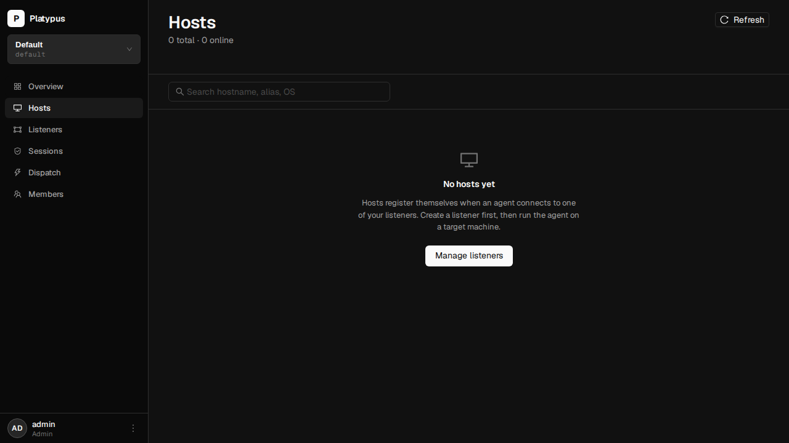
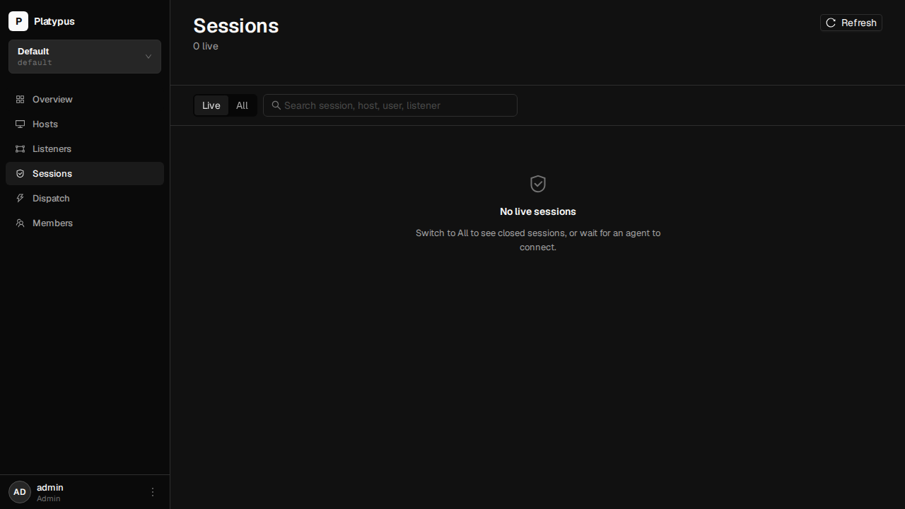

# Platypus UI screenshots

Auto-generated by the Playwright e2e suite — see [`desktop/frontend/e2e/`](../../desktop/frontend/e2e/) for the source. Re-run with `make screenshots` from the repo root.

## Auth

### Login

JWT-gated entry point. Same flow on web and desktop.

### Projects landing

Tile grid of every project the user can see. Click to drill in.

## Shell

### Project sidebar

Linear-style flat nav: project switcher + 6 first-class destinations + user menu.

### Project switcher

Sidebar dropdown: jump between projects without leaving the current view category.

### Projects landing (multi)

Same landing as above with two projects seeded.

## Project pages

### Project overview dashboard

4 KPIs · sessions over 24h · top hosts · recent activity. Primary actions live in the page header.

### Listeners list

Always-visible "+ New listener" in the page header.

### Listener detail

Definition list of endpoint metadata + Stop action.

### Create-listener modal

Bind host + port; modal is reachable from header, empty state, or quick actions.

### Hosts (empty)

Cross-host list. Empty state guides you to the listener page since hosts only appear after an agent connects.

### Sessions (empty)

Cross-host live + historical sessions, with Live/All filter chips.

### Dispatch

Run a command across every flagged live session in the project.

### Project members

ACL editor with role pills (admin / operator / viewer).

## Admin

### Admin · users

Global user CRUD reachable from the user menu.

